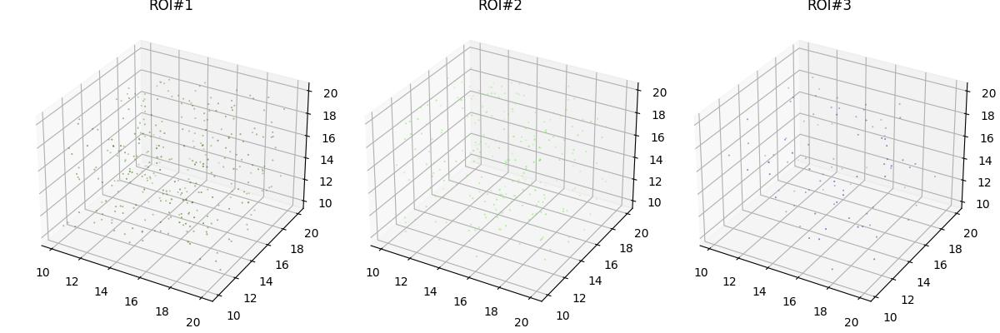

# pydicomrt

Convertion between dicomrt annotations and [numpy.array](https://numpy.org/doc/stable/reference/generated/numpy.array.html).

## Read
`read.py`. This is similar to Matlab's [dicomContours](https://www.mathworks.com/help/images/ref/dicomcontours.html).

## Write
`write.py`. Write coordinates to dicomrt file format.

## Plot ROIs.
Similar to Matlab's [dicomcontours.plotcontour](https://www.mathworks.com/help/images/ref/dicomcontours.plotcontour.html).
The example dicomrt data is from Matlab.
